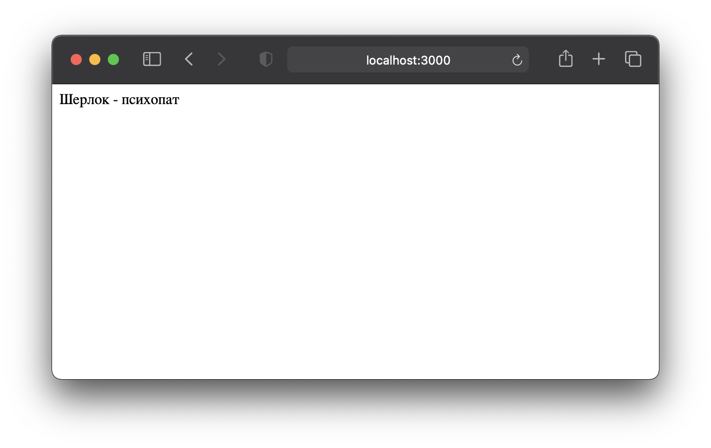
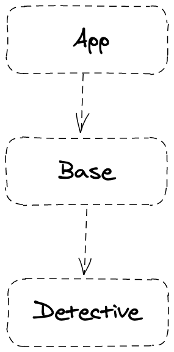

## Задача

Освоить создание переменной стейта.

⏱ время на выполнение: _10 минут_  
📶 сложность: _легко_

## Требования

- Повтори все шаги из предыдущего задания (вместе с компонентами `App` и `Base`)
- Создай еще один компонент с названием `Detective`.
- Создай внутри компонента `Detective` переменную стейта с названием `sherlock`. 
- Значением переменной по умолчанию укажи строку `"психопат"`.
- Выведи эту переменную в браузер в формате "Шерлок - `значение стейта`" (компонент `Detective` должен выводиться через компонент `Base`).
- Как только задание будет готово выгрузи проект на GitHub в отдельный репозиторий.

Должно получиться примерно вот так:

## Советы и подсказки

Твоё приложение имеет такую структуру

- Применять функцию изменения стейта пока не нужно. Это будет в следующей задаче.
- Псц, хочешь немного углубить знание функции `useState()`? Тогда читай [эту статью](https://ru.reactjs.org/docs/hooks-state.html)
