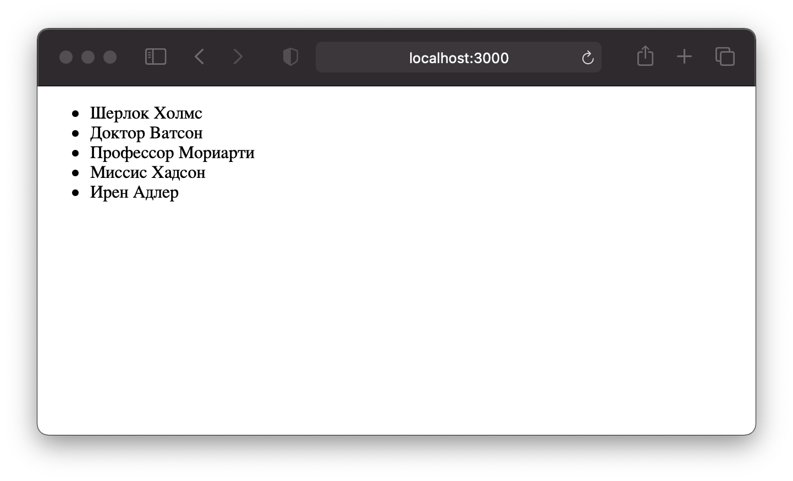

## Задача

Вывести массив через компонент, используя `.map`.

⏱ время на выполнение: _12 минут_  
📶 сложность: <font color="green">_легко_</font>

## Требования

- Создай новое реакт-приложение.
- Создай компоненты с названиями `App` и `Heroes`. Выведи их в такой структуре: `index -> App -> Heroes`.
- Создай в компоненте `Heroes` переменную стейта с именем `names`.
- В качестве значения по умолчанию для этой переменной задай следующий массив: 
```
[
  "Шерлок Холмс", 
  "Доктор Ватсон", 
  "Профессор Мориарти",
  "Миссис Хадсон",
  "Ирен Адлер"
]
```
- Выведи этот массив из компонента в виде маркированного списка. 
- Открой консоль браузера. Видишь ошибку связанную с `key`? Исправь её.
- Как только задание будет готово выгрузи проект на GitHub в отдельный репозиторий.

Визуальный пример:


## Советы и подсказки
- Не беспокойся, что функция `setNames()` осталась неиспользованной. 
Ты исправишь это в следующем задании.
- Чтобы твой маркированный список выглядел так же, как в примере выше тебе нужно 
  взять вывод в тег `<ul>`, в выводимые из мэпа элементы оборачивать в `<li>`.
