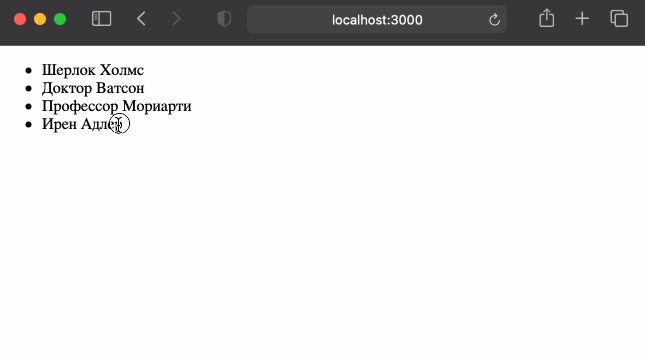

## Задача

Сделать удаление элемента из массива при клике на него.

⏱ время на выполнение: _20 минут_  
📶 сложность: _средняя_

Предстоит сделать следующий функционал:

## Требования

- Повтори все шаги из предыдущего задания (вообще все, даже ошибку с `key` исправь).
- Создай обработчик с именем `handleDelete`. Он должен принимать один параметр, назови его `index`.
- Привяжи этот обработчик к тегу `<li>` на событие `onClick` (этот тег у тебя должен быть внутри мэпа).
- В момент привязки передай в функцию параметр — индекс текущего элемента.
- Доработай обработчик `handleDelete` так, чтобы он удалял из массива `names` элемент с указанным индексом. 
  (да-да, речь о методе `.filter()`).
  Используй `setNames`, чтобы новый массив установился в качестве значения переменной `names`.
- Как только задание будет готово выгрузи проект на GitHub в отдельный репозиторий.

## Советы и подсказки
- Помни, что нельзя во время привязки обработчика события сразу ставить скобки.
Если такая необходимость появилась, то пиши стрелочную функцию, а внутри неё уже функцию со скобками и параметром.
- Для данного задания особенно важно соблюдать временные рамки. 
  Если выполнял задание дольше 20 минут, то делай всё заново.
